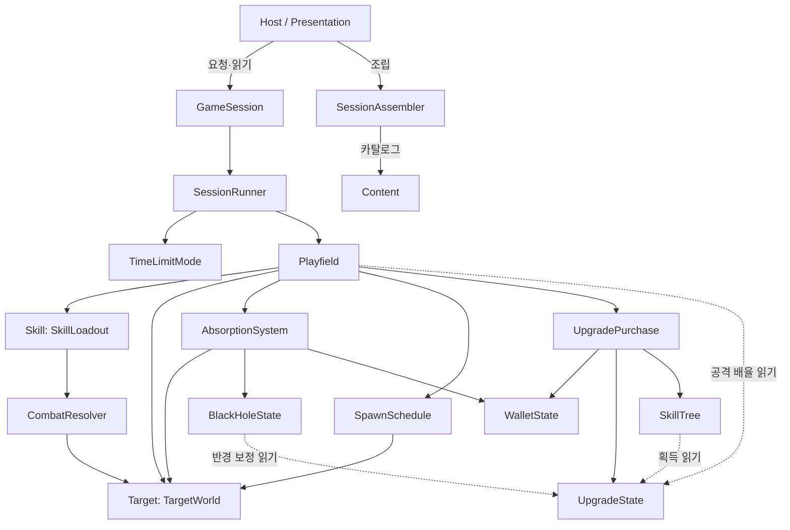

# Black Hole — System Catalog (시스템화 결과)

기준: `blackhole-client/dev`, S0~S7 시스템화 이후. 이전 기록인 [REFERENCE_IMPLEMENTATION.md](REFERENCE_IMPLEMENTATION.md)는 `80549cb` 시점의 실험 기록이다. 현재 구조는 이 문서를 기준으로 한다. 단계별 기준 동작과 상수 이동 기록은 [systemization-baseline.md](systemization-baseline.md)에 있다.

이 문서는 팀 스프레드시트, 의존 지도(FigJam), 티켓을 만들기 위한 입력이다. 클래스 목록을 확정하는 문서가 아니며, 팀 레포에서는 경계와 계약을 유지한 채 구현을 바꿀 수 있다.

## 0. 폴더

폴더는 아래 시스템 구분과 1:1로 맞췄다. 어셈블리는 `BlackHole.Core`(엔진 참조 없음)와 `BlackHole.Unity`(호스트) 두 개이고, namespace는 폴더와 관계없이 `BlackHole.Core` / `BlackHole.Unity`다.

```text
Assets/BlackHole/
  Core/
    Content/     저작 데이터, 로더, 콘텐츠 불변식, 카탈로그, 진단, 수치 검사
    Session/     GameSession, SessionRunner, TimeLimitMode, Playfield(한 단계 순서), SessionAssembler
    Spawn/       출현 정의와 진행
    Target/      대상 정의·상태·목록, 이동 정의·규칙·factory
    Skill/       스킬 정의, 선택·효과 정의와 규칙, factory, SkillLoadout(시전 순서)
    Combat/      CombatResolver(피해·당김 요청 경계)
    Absorption/  블랙홀 정의·상태, 흡수 확정과 보상 지급 순서
    Economy/     보상 정의, 지갑
    Upgrade/     강화 정의·상태·구매 흐름
    SkillTree/   트리 정의·그래프 규칙, 판 안 판정
    Common/      Point2
    Sample/      ReferenceGame — 임의로 정한 샘플 콘텐츠 수치. 기획 값이 아니다
  Unity/         호스트(조립·수명·입력·HUD·화면·표현 정의 샘플)
  Tests/EditMode 계약 테스트(Unity EditMode와 tests/CoreSmoke가 같은 계약을 실행)
```

## 1. 한 판의 흐름

```text
[조립]  ContentData ─ContentLoader→ ContentCatalog(검증된 공유 정의)
        ContentCatalog ─SessionAssembler→ GameSession(판마다 새 실행 상태)

[한 프레임, 호스트]  재시작 요청(있으면 새 판만 보이고 끝)
                     → 일시정지 전환 → Advance(deltaTime) → 시전·강화·노드 요청 → 화면 갱신

[Advance]  SessionRunner가 프레임을 단계(최대 1/30초)로 나눈다
           단계마다: 진행 전 제한(TimeLimitMode.LimitStep)
                     → Playfield 한 단계: 쿨다운 → 이동 → 흡수·보상·제거 → 출현
                     → 진행 후 판정(TimeLimitMode.TryEnd) → 끝이면 GameSession이 결과 확정

[시전]     자격(알 수 없음·쿨다운) → 선택 확정 → 대상별 효과 순서대로 적용 → 적용이 있으면 쿨다운
[구매]     참조 → 최고 단계 → 트리 선행 조건 → 비용 → 확정(재화 차감, 단계 상승)
```

요청은 언제나 진행 뒤에 적용한다. 그 진행에서 판이 끝났다면 Session이 `SessionInactive`로 거절한다.

## 2. 시스템 요약

| 시스템 | 책임 | 소유 상태 (수명) | 외부에 주는 것 | 의존 |
|---|---|---|---|---|
| Content | 저작 데이터 검증, 공유 정의 묶음 구성 | 읽기 전용 정의 (콘텐츠 수명, 여러 판이 공유) | `ContentLoadResult`(카탈로그 또는 경로별 진단) | 각 시스템의 정의 타입·factory |
| Session / Mode | 판 시작·일시정지·종료, 요청 허용, 시간 분할, 종료 판정 | 판 상태·결과(GameSession), 경과 시간(SessionRunner) (한 판) | 요청 API, `Phase`·`Remaining`·`Result` | Playfield, TimeLimitMode |
| Spawn | 언제·무엇을·어디에 출현시키는가 | 출현 타이머·순번 (한 판) | TargetWorld에 출현 요청 | TargetWorld, 대상 정의 |
| Target / Movement | 대상 목록·ID, HP·위치·생명주기, 이동 규칙 | 대상 목록(TargetWorld), 개체 상태(TargetState) (출현~제거) | 읽기 전용 대상 목록 | 이동 규칙, 대상 공통 규칙 |
| Skill | 보유 스킬·쿨다운, 대상 선택, 시전 순서 | 스킬별 쿨다운 (한 판, 스킬 사용자 한 명) | `CastResult` + `CastReport` | TargetWorld(읽기), CombatResolver, 공격 배율(Playfield가 강화에서 계산) |
| Combat / Effect | 피해·당김 요청을 대상 상태 주인에게 전달 | 없음 | 적용 여부(bool) | TargetWorld, TargetState |
| BlackHole / Absorption | 흡수 판정·확정, 블랙홀 성장 | 질량·흡수 수 (한 판) | 흡수 반경(계산값), `Mass` | Upgrade(반경 보정), Reward |
| Reward / Economy | 보상 내용(질량·재화), 잔액 | 잔액(WalletState) (한 판) | `Credits` | — |
| Upgrade | 강화 비용·단계·보정, 구매 흐름 | 강화별 단계 (한 판, 획득 여부의 유일한 원본) | `UpgradeResult`, `Level`·`NextCost`·`Bonus` | Wallet, SkillTree(자격) |
| SkillTree | 그래프 규칙, 선행 조건, 획득 가능성 | 없음 (그래프는 정의, 획득은 Upgrade) | `NodeStatus`, 구매 자격 | UpgradeState(읽기) |
| Host / Presentation | 조립, Unity 수명, 입력 해석, 화면·HUD, 표현 정의 | 뷰 객체·연출·메시지 (호스트 수명) | 게임 요청 | GameSession(요청·읽기) |

## 3. Core 내부의 상태 변경 경로

`internal`은 Unity의 직접 변경을 막지만 Core 안의 소유권까지 컴파일러가 강제하지는 않는다. 아래 경로 밖에서 상태를 바꾸는 코드는 리뷰에서 거절한다.

| 상태 | 주인 | 변경 메서드 | 호출하는 곳 |
|---|---|---|---|
| HP, 사망 전이 | TargetState | `ApplyDamage` | CombatResolver.Damage ← DamageEffect |
| 반경(당김) | TargetState | `Pull` | CombatResolver.Pull ← PullEffect |
| 위치(이동·낙하), 나이 | TargetState | `Move` | TargetWorld.Move ← Playfield.Advance |
| 흡수 전이 | TargetState | `TryAbsorb` | AbsorptionSystem.Resolve |
| 대상 목록·ID | TargetWorld | `Spawn` / `RemoveAbsorbed` | SpawnSchedule.Advance / AbsorptionSystem.Resolve |
| 출현 타이머·순번 | SpawnSchedule | `Advance` | Playfield.Advance |
| 쿨다운 | SkillState | `Advance` / `BeginCooldown` | SkillLoadout.Advance / SkillLoadout.TryCast |
| 질량·흡수 수 | BlackHoleState | `Absorb` | AbsorptionSystem.GrantReward |
| 잔액 | WalletState | `Deposit` / `Withdraw` | AbsorptionSystem.GrantReward / UpgradePurchase.TryPurchase |
| 강화 단계 | UpgradeState | `Raise` | UpgradePurchase.TryPurchase |
| 경과 시간 | SessionRunner | `Advance` | GameSession.Advance |
| 판 상태·결과 | GameSession | `TogglePause` / `Stop` / 종료 판정 | 호스트 요청 / SessionRunner 결과 |

저장하지 않고 매번 계산하는 값: 공격 배율(`1 + 강화 보정`), 흡수 반경(`BlackHoleDefinition` 공식 + 강화 보정), 노드 상태(강화 단계에서 판정).

## 4. 시스템 카드

각 카드의 "완료 조건"은 팀 레포에서 해당 시스템을 제품 수준으로 옮길 때의 최소 기준이다. "규모"는 현재 코드 줄 수와 해당 단계의 변경량이며 작업 시간이 아니다. 시간은 담당자 경험을 반영해 팀이 추정한다.

### Content

- **파일**: `ContentData`, `ContentLoader`, `ContentInvariants`, `ContentCatalog`, `ContentDiagnostic`, `DefinitionGuard`, `ReferenceGame`(샘플)
- **입력 → 출력**: `ContentData` → `ContentLoadResult { Catalog | Diagnostics }`. 오류가 하나라도 있으면 카탈로그를 만들지 않는다.
- **규칙의 자리**: 수치 규칙은 각 정의 생성자, 콘텐츠 전체 규칙(ID 유일, 참조 실재, 실행 규칙 해석 가능)은 `ContentInvariants`, 데이터 모양(빈 칸, 종류 이름, 종류가 쓰지 않는 칸)은 로더. 로더와 생성자는 같은 규칙을 호출한다(복제하지 않는다).
- **선행 작업**: 없음. 다른 모든 시스템의 정의 타입과 함께 움직인다.
- **위험**: 높음. 모든 시스템이 정의 모양에 기대므로 정의 변경이 여기로 모인다. 팀 작업에서는 ID·정의 로딩 계약을 가장 먼저 합의한다.
- **병렬**: 시스템별 정의·로더 섹션은 병렬 가능. 로더 파일 하나를 여럿이 고치면 충돌이 잦으므로 섹션 담당을 정한다.
- **규모**: Core 약 750줄(로더 321). S1 변경 +911/−155.
- **완료 조건**: SO 등 저작 형식 → `ContentData` 변환. 잘못된 콘텐츠는 판 시작 전에 경로와 이유를 보고. 같은 카탈로그로 만든 두 판이 실행 상태를 공유하지 않음.

### Session / Mode

- **파일**: `GameSession`, `SessionRunner`, `TimeLimitMode`(정의 + 판정), `SessionAssembler`
- **입력**: `Advance(delta)`, `TryCast`, `TryPurchaseUpgrade`, `TryAcquireNode`, `TogglePause`, `Stop`
- **출력**: `Phase`, `Elapsed`, `Remaining`, `Result`(종료 시 한 번 확정되는 스냅샷), `Field`(읽기)
- **새 목표 추가 위치**: 모드의 두 경계, 즉 진행 전 `LimitStep`과 진행 후 `TryEnd`. 판정 정밀도는 실행 단계 단위다. 모드가 둘이 되면 그때 교체 지점(인터페이스)을 만든다.
- **선행 작업**: Content(판 설정 정의).
- **위험**: 중간. 종료 프레임 처리와 요청 순서를 바꾸면 여러 계약이 동시에 깨진다.
- **규모**: 약 200줄. S2 변경 +463/−145(호스트 포함).
- **완료 조건**: 정지·종료 뒤 상태 변경 없음. 재시작 시 이전 판 상태 없음. 제한 시간 초과 진행 없음.

### Spawn

- **파일**: `SpawnDefinition`, `SpawnSchedule`
- **입력 → 출력**: 단계 시간 → `TargetWorld.Spawn(정의, 반경, 각도)` 요청.
- **새 종류 추가 위치**: 지금은 순서·간격·각도 간격 데이터뿐이다. 웨이브나 난수 배치가 필요하면 출현 규칙을 이동 규칙처럼 정의 + factory로 분리한다. 난수는 공급원을 드러낸다(PLAN 4절).
- **선행 작업**: Target(출현 요청 계약).
- **위험**: 낮음. **병렬**: 가능.
- **완료 조건**: 상한·간격·순서가 정의에서 오고, 대상 행동을 소유하지 않음.

### Target / Movement

- **파일**: `TargetDefinition`(+ `RewardDefinition`, `TargetRulesDefinition`), `TargetState`, `TargetWorld`, `MovementDefinition`, `MovementRules`, `MovementRuleFactory`
- **생명주기**: Alive → Defeated(피해) → Absorbed(흡수 확정, 같은 단계에 목록에서 제거). 사망만으로는 보상이 없다.
- **이동**: 살아 있는 대상은 정의의 이동 규칙을 따르되 하한(흡수 반경 + 여유) 안으로 들어가지 않는다. 사망한 대상은 이동 규칙의 각도 변화를 유지하고 공통 속도로 낙하한다.
- **새 이동 방식 추가 위치**: 하위 정의 + `MovementRules`의 규칙 + factory 분기 + 로더 종류 이름. Dive 추가 때 상태·Spawn·Session·화면은 바뀌지 않았다(`f5ba0d2`).
- **선행 작업**: Content.
- **위험**: 중간. 위치 원본은 `TargetState` 하나다. Unity Transform이나 물리를 원본으로 만들지 않는다.
- **병렬**: 이동 규칙 추가는 독립적이다. 생명주기 변경은 Skill·Absorption과 계약을 합의해야 한다.
- **규모**: 약 300줄. S3 변경 +334/−49, Dive +112/−2.
- **완료 조건**: 출현·이동·사망·흡수·제거의 주인이 코드에서 드러남. 새 이동 방식이 규칙과 조립 지점에서만 추가됨.
- **`Target` → `Enemy` 이름 변경**: 적 행동(공격 등)이 도입될 때 결정한다.

### Skill

- **파일**: `SkillDefinition`(+ `SkillState`, `CastResult`, `CastReport`), `SkillPartsDefinition`(선택·효과 정의), `SkillRules`(선택·효과 규칙), `SkillRuleFactory`, `SkillLoadout`
- **정의**: 쿨다운 + 대상 선택(`NearestInRadius`, `AllInRadius`) + 효과 목록(`Damage`, `Pull`, 적용 순서).
- **출력**: `CastResult`와 `CastReport`(조준점, 선택 범위, 적용 대상 수). 화면은 스킬 수치 대신 이것으로 연출한다.
- **새 종류 추가 위치**: 기존 선택·효과의 조합은 데이터만으로 만든다. 예: 피해 없는 범위 당김. 새 선택·효과의 의미는 하위 정의 + 규칙 + factory 분기 + 로더 종류 이름으로 추가한다. Session·HUD에는 종류별 분기가 없다.
- **선행 작업**: Target 계약(조회·변경 요청), Upgrade(공격 배율).
- **위험**: 중간. 지속 효과·투사체가 들어오면 "효과는 즉시 적용되고 상태가 없다"는 전제가 바뀐다.
- **규모**: 약 380줄. S4 변경 +561/−203.
- **완료 조건**: 쿨다운 확정 시점, 빈 조준, 알 수 없는 스킬의 결과가 계약대로. 사망 대상 제외, 처치 대상에 뒤 효과 적용.

### Combat / Effect

- **파일**: `CombatResolver`. 효과 규칙은 `SkillRules`에 있다.
- **입력 → 출력**: `Damage(id, amount)`, `Pull(id, distance)` → 적용 여부. 전이 가능 여부는 `TargetState`가 판정한다.
- **다음 검토 지점**: 방어·저항·시전자 귀속(4인 협동)이 필요해지면 여기서 규칙을 검토한다. 대상 탐색은 선형이다(§8).
- **위험**: 낮음. **병렬**: Skill과 같은 담당 권장.

### BlackHole / Absorption

- **파일**: `BlackHoleState`(+ `BlackHoleDefinition`), `AbsorptionSystem`
- **순서(한 흐름)**: 단계 시작 반경으로 판정 → Defeated → Absorbed 전이 → 질량(블랙홀)·재화(지갑) 반영 → 같은 단계에 제거. 뷰 Destroy나 사망 콜백에서 보상을 주지 않는다.
- **선행 작업**: Target(흡수 전이), Upgrade(반경 보정).
- **위험**: 중간. 보상 중복 방지가 이 순서에 달려 있다.
- **완료 조건**: 보상은 한 번. 질량과 재화 증가량을 독립적으로 바꿀 수 있음.

### Reward / Economy

- **파일**: `RewardDefinition`(TargetDefinition.cs), `WalletState`
- **경로**: 지급은 흡수 확정, 소비는 구매 확정으로만 일어난다.
- **미정**: 영구 재화와 판 밖 성장은 아직 없다(§6).

### Upgrade

- **파일**: `UpgradeState.cs`(`UpgradeDefinition`, `UpgradeState`, `UpgradePurchase`, `UpgradeResult`, `UpgradeStat`)
- **정의**: n단계 비용 = BaseCost × n, 최대 단계, 대상 계산(`DamageMultiplier` | `AbsorptionRadius`), 단계당 보정.
- **구매 흐름**: 참조 → 최고 단계 → 트리 잠금 → 비용 → 확정. 확정 구간에 I/O나 콜백이 없다. 원자성의 근거는 앞선 판정이 실패 조건을 모두 소진했다는 데 있다.
- **새 종류 추가 위치**: 같은 계산에 대한 강화는 데이터만으로 추가한다(`reach`, `3cf8d3f`: 콘텐츠와 테스트만 변경). 새 계산 대상(예: 쿨다운 감소)은 `UpgradeStat` 값 + 그 값을 쓰는 계산 한 곳 + 로더 이름으로 추가한다. 범용 능력치 엔진은 만들지 않았다.
- **선행 작업**: Wallet, SkillTree(자격).
- **완료 조건**: 실패 시 잔액·단계가 모두 그대로. 성공한 강화가 실제 피해·흡수 판정에 반영됨.

### SkillTree

- **파일**: `SkillTreeDefinition`(+ `SkillTreeNodeDefinition`, `SkillTreeInvariants`), `SkillTree`
- **규칙(최소 검증안)**: 비순환, 선행 노드 전부 획득(AND), 루트는 무조건. 노드 하나는 강화 하나를 참조하고, 한 강화는 한 노드만 참조한다. 노드 획득 = 참조 강화 1단계 이상.
- **경로**: 노드 요청(`TryAcquireNode`)은 참조 강화의 구매로 바뀐다. 직접 구매도 같은 자격 판정을 거치므로 트리 조건을 우회할 수 없다.
- **화면**: 좌표와 연결선은 규칙에 없다. 현재 HUD는 목록으로 표시한다.
- **선행 작업**: Upgrade 구매 흐름.
- **규모**: 약 210줄. 변경 +468/−15(Core), +104/−34(샘플·HUD).
- **완료 조건**: 분기·합류 그래프를 데이터로 표현. 중복·누락·순환 거부. 잠김·중복 획득·재화 부족에서 상태 보존.

### Host / Presentation (Unity)

- **파일**: `ReferenceGameController`(조립 루트, 수명, 프레임 순서), `SessionLauncher`(판 시작·교체·종료), `ReferenceInput`(장치 → 요청), `ReferenceHud`(읽기 표시 + 버튼 요청), `ReferenceWorldView`(뷰 객체·연출), `ReferencePresentation`(표현 정의)
- **수명 정책**: 비활성화하면 판을 끝내고, 재활성화하면 새 판을 시작한다. 최초 활성화도 같은 `OnEnable` 경로다.
- **읽기 방향**: 화면·HUD는 판 상태를 매 프레임 읽는다. 월드를 복사하지 않는다. 이벤트 구독이 없으므로 재시작 때 구독이 누적될 곳도 없다. 이벤트가 도입되면 연결·해제 수명을 검증한다.
- **표현 정의**: 콘텐츠 ID별 외형(색·크기·범례 이름)과 화면 설정. 외형이 없는 대상은 기본 외형으로 그리고, 조립 시 경고한다.
- **입력**: 숫자 키 = 보유 스킬 칸, U/I/O = HUD 강화 목록 칸(트리 강화 제외), 마우스 = 조준.
- **위험**: 중간. 현재 HUD는 IMGUI 샘플이다. 제품 UI는 새로 만들되 요청 경로(GameSession API)와 읽기 방향은 유지한다.
- **완료 조건**: UI가 초기화 순서를 모른 채 시작·재시작 가능. 정지·종료 뒤 변경 없음. 재시작에 뷰가 누적되지 않음.

## 5. 의존 관계

화살표는 "호출하거나 읽는다"는 뜻이다. 모든 정의는 Content가 검증하고 SessionAssembler가 조립한다.



작업 순서(선행 → 후행): Content 계약 → Session → Target → (Skill, Spawn 병렬) → BlackHole·Reward → Upgrade → SkillTree. Host·Presentation은 각 단계의 읽기 계약이 정해지면 병렬로 진행할 수 있다.

## 6. 미정 기획과 확인이 필요한 가정

**팀 기획이 정해야 하는 것**

- 플레이어 캐릭터, 적의 공격, 실패 조건. 현재는 시간 종료와 수동 종료만 있다.
- 판 밖에 남는 것: 영구 재화, 해금, 강화, 저장 범위, 이어하기.
- 트리: OR 조건, 여러 단계를 가진 강화를 노드에 넣었을 때의 의미, 스킬 포인트, 초기화 비용.
- 모드: 시간제 외 목표(질량 도달 등)와 종료 보상.
- 목표 화면 내 대상 수와 PC 성능 예산.
- 콘텐츠 저작 방식(SO 전환 시점)과 ID 명명 규칙.

**구현하며 둔 가정(기획 확인 필요)**

| 가정 | 위치 |
|---|---|
| 빈 조준은 쿨다운을 소비하지 않는다 | `SkillLoadout.TryCast` |
| 사망한 대상은 이동 각도를 유지한 채 낙하한다(나선) | `TargetState.Move` |
| Dive: 각도 고정, 속도 = 초기 속도 + 가속도 × 나이(검증용 콘텐츠) | `DiveMovement` |
| 보상 질량·재화는 0 이상(0 허용) | `RewardDefinition` |
| 강화 비용은 선형(n단계 = BaseCost × n) | `UpgradeDefinition` |
| 트리: 노드 1개 = 강화 1개, 획득 = 1단계 이상, AND, 비순환 | `SkillTree` |
| 모든 성장·재화는 한 판 수명 | `WalletState`, `UpgradeState` |

## 7. 검증 단위와 측정

**자동 계약 (`CoreContracts`, 38개)**: Unity EditMode와 .NET 실행기(`tests/CoreSmoke`, CI `Core contracts`)가 같은 계약을 실행한다.

| 시스템 | 계약 |
|---|---|
| 기준 동작 | `BaselineAtCoarseFixedStep`, `BaselineAtFrameFixedStep`, `ReferenceLoopReachesGrowthUpgradeAndEnd` |
| Content | `DefinitionsRejectInvalidData`, `SharedCatalogKeepsSessionStateIsolated`, `LoaderReportsEveryDefinitionErrorWithPath`, `LoaderReportsReferenceErrorsWithPath`, `CatalogConstructorEnforcesSameInvariants` |
| Session | `PauseFreezesAllSimulationState`, `EndRejectsCommandsAndFreezesResult`, `RestartHasFreshState`, `FinalFrameIsClippedToTimeLimit`, `EndingFrameRejectsSameFrameRequests` |
| Target / Movement | `TargetCapacityAndTwoDefinitionsAreUsed`, `TargetLifecycleRulesComeFromDefinition`, `NewMovementRuleUsesSharedLifecycle`, `LoaderReportsMovementAndTargetRuleErrors`, `LoaderRejectsFieldsUnusedByMovementKind` |
| Skill / Combat | `StrikeSelectsOneAndPulseHitsMany`, `PulsePullsWithoutOwningReward`, `CooldownAndNoTargetHaveDistinctResults`, `CooldownExpiresBeforeSameFrameRequest`, `NewSkillNeedsOnlyDefinition`, `DamagelessAreaPullIsOnlyComposition`, `CastReportCarriesAppliedArea`, `AreaSkipsDefeatedAndPullsWhatItKills`, `LoaderReportsSkillCompositionErrors` |
| BlackHole / Reward | `DeathDoesNotRewardUntilAbsorption`, `AbsorptionRewardsExactlyOnce`, `AbsorptionHappensInStepReachingRadius`, `RewardMassAndCreditsAreIndependent` |
| Upgrade | `UpgradeFailureIsAtomicAndSuccessChangesDamage`, `RejectedPurchaseChangesNothing`, `AbsorptionRadiusUpgradeAppliesToAbsorption`, `LoaderReportsGrowthAndUpgradeErrors` |
| SkillTree | `SkillTreeBranchAndMergeRequireAll`, `RejectedTreeRequestsPreserveState`, `SkillTreeRejectsBrokenGraph` |

**자동화되지 않은 것**: Unity 호스트(입력, HUD, 화면, 재시작·재활성화 수명)는 각 단계마다 사람이 플레이해서 확인했다. PlayMode 테스트는 없다. CI의 Core 컴파일 성공은 호스트 컴파일·입력·바인딩 검증이 아니다.

**Core 규모 측정** (.NET, net8.0 대상, 개발 PC 1대, 스크립트 입력 + 1/60초 진행, 대상 HP를 크게 해 목록 유지):

| 대상 수 | Core 시간 (μs/프레임) | 할당 (B/프레임) |
|---|---|---|
| 32 | 3.1 | 0.2 |
| 256 | 20.4 | 1.2 |
| 1024 | 72.9 | 6.0 |

Unity(Mono/IL2CPP)의 Core 비용, 화면(SpriteRenderer 대상당 1개), IMGUI HUD 비용은 포함하지 않는다. 제품 규모의 성능은 목표 대상 수를 정한 뒤 Unity에서 다시 측정한다.

## 8. 알려진 한계

- `CombatResolver`의 대상 탐색이 선형(`Find`)이다. 범위 효과 비용은 선택 수 × 전체 대상 수다. 대상이 많아지면 ID → 인덱스 맵을 둔다.
- 출현마다 이동 규칙 객체를 하나 할당한다. 규칙은 상태가 없으므로 정의별로 공유할 수 있다.
- `TargetWorld.RemoveAbsorbed`는 `RemoveAt` 기반이다(O(n²) 최악). 대규모에서는 교환 제거로 바꾼다.
- 화면은 대상마다 GameObject를 만들고 지운다(풀링 없음).
- `CoreContracts.cs`가 한 파일(약 1,000줄)이다. 팀 레포에서는 시스템별 파일로 나누면 병렬 편집 충돌이 줄어든다.
- 콘텐츠와 표현 정의는 코드 샘플(`ReferenceGame`, `ReferencePresentation`)이다. SO 전환 시 코드 샘플을 지우고 한 곳에서만 관리한다.
- 네트워크 권위, 복제, 예측은 없다. 스킬 사용자는 논리적으로 한 명이고, 쿨다운은 사용자에게, 질량은 월드에 속한다. 협동으로 가면 시전자 식별과 상태 변경 권위를 이 경계에 추가한다.
